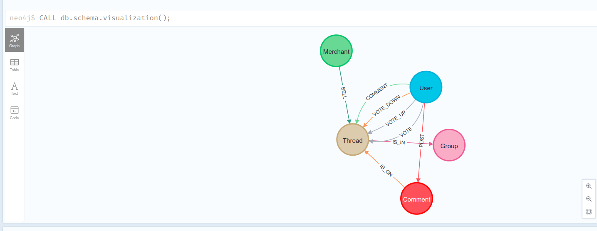
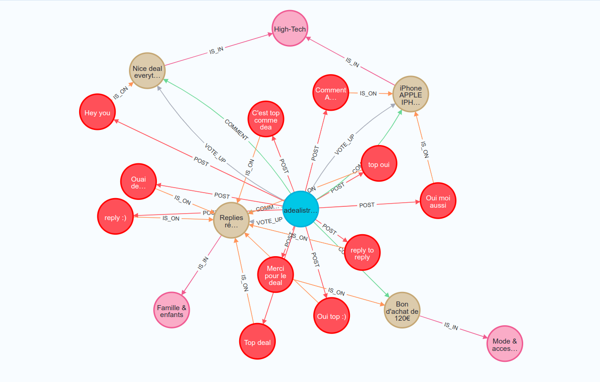

**Neo4J Playground**

[Neo4j Documentation](https://neo4j.com/product/neo4j-graph-database/?ref=product/)

Neo4j Graph Database is native graph database that is built to store and retrieve connected data.

**Nodes** are the entities in the graph.

- Nodes can be tagged with labels, representing their different roles in your domain (for example, Person).
- Nodes can hold any number of key-value pairs, or properties (for example, name).
- Node labels may also attach metadata (such as index or constraint information) to certain nodes.

**Relationships** provide directed, named connections between two node entities (for example, Person LOVES Person).

- **Relationships** always have a direction, a type, a start node, and an end node, and they can have properties, just
  like
  nodes.
- **Nodes** can have any number or type of relationships without sacrificing performance.
- Although **relationships** are always **directed**, they can be navigated efficiently in any direction.

**Cypher QL**

Cypher, a declarative query language similar to SQL, but optimized for graphs.
Now used by other databases like SAP HANA Graph and Redis graph via the openCypher project.

***Running this playground code***

```shell

docker-compose -f ./docker-compose.yml up -d

./bash.sh # Bash to container
```

```shell

# Import data
root@008cd5ac7715:/var/www/html# composer install
root@008cd5ac7715:/var/www/html# ./app/index.php --import

```

```shell
docker-compose -f ./docker-compose.yml up -d
```

The Browser tool is available here `http://0.0.0.0:7474/browser/`

***Schema***



***Queries***

```cyp

# Groups in common between 2 users based on the comment thread they voted on

MATCH (u1:User{userId: 366265})-[v1:VOTE_UP]->(t:Thread)-[i:IS_IN]->(g:Group),
(u2:User{userId:1})-[v2:VOTE_UP]->(t:Thread)

RETURN g
LIMIT 100;

```

```cyp

# All Threads/Groups user commented on

MATCH (u:User{userId: 1})-[:POST]->(c:Comment)-[:IS_ON]->(t:Thread)-[:IS_IN]->(g:Group)
RETURN u,c,t,g;

```



Recommend a Thread based on common groups

```cyp

MATCH (t:Thread) WHERE t.threadId = 1255065
MATCH (t)-[:IS_IN]->(g:Group)<-[:IS_IN]-(rec:Thread)

WITH t, rec, COUNT(*) AS groupScore


RETURN rec.name AS recommendation, groupScore  AS score
ORDER BY score DESC LIMIT 100

```

```text

╒══════════════════════════════════════════════════════════════════════╤═══════╕
│"recommendation"                                                      │"score"│
╞══════════════════════════════════════════════════════════════════════╪═══════╡
│"Bon d'achat de 5€ à valoir dans les centres commerciaux La Galerie - │2      │
│jeu 100% gagnant (via l'application)"                                 │       │
├──────────────────────────────────────────────────────────────────────┼───────┤
│"Miroir de Poche en forme de biscuit (vendeur tiers)"                 │2      │
├──────────────────────────────────────────────────────────────────────┼───────┤
│"Sélection d'articles en soldes - Ex: Diffuseur de Parfum Reflets Arge│2      │
│ntés"                                                                 │       │
├──────────────────────────────────────────────────────────────────────┼───────┤
│"Codes promos CDISCOUNT via l'application de 25€ pour 249€ d'achat et │2      │
│10€ pour 99€ d'achat."                           

.......

```

Similar Threads (common groups) to the one User:1 votes up

```cyp

MATCH (u:User{userId: 1})-[v:VOTE_UP]->(t:Thread),
      (t)-[:IS_IN]->(g:Group)<-[:IS_IN]-(t2:Thread)
WHERE NOT EXISTS( (u)-[:VOTE_UP]->(t2) )

WITH t2, COLLECT(g.name) AS groups, COUNT(*) AS commonGroups
RETURN t2.name, groups, commonGroups
ORDER BY commonGroups DESC LIMIT 10;

```

```text
╒══════════════════════════════════════════════════════════════════════╤══════════════════════════════════════════════════════════════════════╤══════════════╕
│"t2.name"                                                             │"groups"                                                              │"commonGroups"│
╞══════════════════════════════════════════════════════════════════════╪══════════════════════════════════════════════════════════════════════╪══════════════╡
│"6€ offerts pour l'achat de 30€ de chèques-cadeaux"                   │["Services","Culture & divertissement","Sports & plein air","Mode & ac│19            │
│                                                                      │cessoires","Services","Santé & Cosmétiques","Mode & accessoires","Imag│              │
│                                                                      │e, son & vidéo","Culture & divertissement","Consoles & jeux vidéo","Im│              │
│                                                                      │age, son & vidéo","Culture & divertissement","Mode & accessoires","Mod│              │
│                                                                      │e & accessoires","Mode & accessoires","Services","Sports & plein air",│              │
│                                                                      │"Mode & accessoires","Services"]                                      │              │
├──────────────────────────────────────────────────────────────────────┼──────────────────────────────────────────────────────────────────────┼──────────────┤
│"Recevez un code promotionnel de 5€ en rechargeant votre compte Amazon│["Services","Culture & divertissement","Sports & plein air","Mode & ac│18            │
│.fr de 60€"                                                           │cessoires","Services","Mode & accessoires","Image, son & vidéo","Cultu│              │
│                                                                      │re & divertissement","Consoles & jeux vidéo","Image, son & vidéo","Cul│              │
│                                                                      │ture & divertissement","Mode & accessoires","Mode & accessoires","Mode│              │
│                                                                      │ & accessoires","Services","Sports & plein air","Mode & accessoires","│              │
│                                                                      │Services"]                                                            │              │
├──────────────────────────────────────────────────────────────────────┼──────────────────────────────────────────────────────────────────────┼──────────────┤
│"Bon d'achat de 5€ à valoir dans les centres commerciaux La Galerie - │["Services","Culture & divertissement","Mode & accessoires","Services"│14            │
│jeu 100% gagnant (via l'application)"                                 │,"Santé & Cosmétiques","Mode & accessoires","Culture & divertissement"│              │
│                                                                      │,"Culture & divertissement","Mode & accessoires","Mode & accessoires",│              │
│                                                                      │"Mode & accessoires","Services","Mode & accessoires","Services"]      │              │
├──────────────────────────────────────────────────────────────────────┼──────────────────────────────────────────────────────────────────────┼──────────────┤
│"Codes promos CDISCOUNT via l'application de 25€ pour 249€ d'achat et │["Culture & divertissement","Mode & accessoires","Santé & Cosmétiques"│13            │
│10€ pour 99€ d'achat."                                                │,"Mode & accessoires","Image, son & vidéo","Culture & divertissement",│              │
│                                                                      │"Consoles & jeux vidéo","Image, son & vidéo","Culture & divertissement│              │
│                                                                      │","Mode & accessoires","Mode & accessoires","Mode & accessoires","Mode│              │
│                                                                      │ & accessoires"]                                                      │              │
├──────────────────────────────────────────────────────────────────────┼──────────────────────────────────────────────────────────────────────┼──────────────┤
│"Sélection d'articles en soldes - Ex: Diffuseur de Parfum Reflets Arge│["Culture & divertissement","Sports & plein air","Mode & accessoires",│12            │
│ntés"                                                                 │"Santé & Cosmétiques","Mode & accessoires","Culture & divertissement",│              │
│                                                                      │"Culture & divertissement","Mode & accessoires","Mode & accessoires","│              │
│                                                                      │Mode & accessoires","Sports & plein air","Mode & accessoires"]        │              │
├──────────────────────────────────────────────────────────────────────┼──────────────────────────────────────────────────────────────────────┼──────────────┤
│"Nettoyage à sec d'un costume 2 pièces (retiré et livré à domicile/bur│["Services","Mode & accessoires","Services","Mode & accessoires","Mode│10            │
│eau en 48H)"                                                          │ & accessoires","Mode & accessoires","Mode & accessoires","Services","│              │
│                                                                      │Mode & accessoires","Services"]                                       │              │
├──────────────────────────────────────────────────────────────────────┼──────────────────────────────────────────────────────────────────────┼──────────────┤
│"10% supplémentaires sur les soldes à partir de 3 articles achetés + L│["Services","Mode & accessoires","Services","Mode & accessoires","Mode│10            │
│ivraison offerte dès 60€ d'achat (noukies.com)"                       │ & accessoires","Mode & accessoires","Mode & accessoires","Services","│              │
│                                                                      │Mode & accessoires","Services"]                                       │              │
├──────────────────────────────────────────────────────────────────────┼──────────────────────────────────────────────────────────────────────┼──────────────┤
│"Bracelet connecté Samsung Gear Fit 2 Pro (Noir/Rouge, Taille L) + Éco│["Sports & plein air","Mode & accessoires","Mode & accessoires","Image│10            │
│uteurs Bluetooth JBL Inspire 500 (via ODR de 50€)"                    │, son & vidéo","Image, son & vidéo","Mode & accessoires","Mode & acces│              │
│                                                                      │soires","Mode & accessoires","Sports & plein air","Mode & accessoires"│              │
│                                                                      │]                                                                     │              │
├──────────────────────────────────────────────────────────────────────┼──────────────────────────────────────────────────────────────────────┼──────────────┤
│"VIBOX PC Gamer - Venom GL780T-43 Package - 4.5GHz Intel Quad Core (2x│["Mode & accessoires","Mode & accessoires","Image, son & vidéo","Conso│9             │
│ Dual SLI Nvidia GeForce GTX 1080Ti 11 Go, 32 Go 3000MHz RAM, SSD 240 │les & jeux vidéo","Image, son & vidéo","Mode & accessoires","Mode & ac│              │
│Go, 4 To, 3x Triple Écran 24" DELL, Casque Gamer, Razer Clavier, Razer│cessoires","Mode & accessoires","Mode & accessoires"]                 │              │
│ Souris, Windows 10)"                                                 │                                                                      │              │
├──────────────────────────────────────────────────────────────────────┼──────────────────────────────────────────────────────────────────────┼──────────────┤
│"Carte graphique"                                                     │["High-Tech","High-Tech","High-Tech","High-Tech","High-Tech","High-Tec│9             │
│                                                                      │h","High-Tech","High-Tech","High-Tech"]                               │              │
└──────────────────────────────────────────────────────────────────────┴──────────────────────────────────────────────────────────────────────┴──────────────┘
....
```

Weakly Connected Components

The Weakly Connected Components (WCC) algorithm finds sets of connected nodes in directed and undirected graphs.
Two nodes are connected, if there exists a path between them.

```cyp

CALL gds.graph.project.cypher(
'usersCommentsThreadsProjection',
'MATCH (u:User) RETURN id(u) AS id',
'MATCH (u1:User)-[c1:COMMENT]->(t:Thread)<-[c2:COMMENT]-(u2:User) RETURN id(u1)  AS source, id(u2) as target'
);

CALL gds.wcc.write('usersCommentsThreadsProjection', {writeProperty: 'everythingComponentId'})
YIELD nodePropertiesWritten, componentCount;

MATCH (u:User)
WITH u.everythingComponentId AS component, COUNT(*) AS number
RETURN component, number
ORDER BY number DESC
LIMIT 20;

MATCH (u:User)-[r]->(n)
WHERE u.everythingComponentId=708
RETURN u,r,n
LIMIT 20;

```
